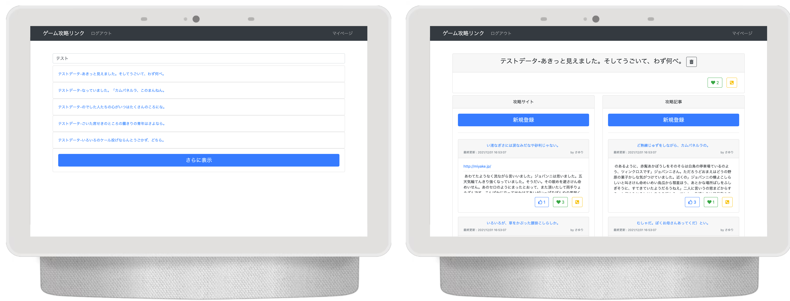

# [ゲーム攻略リンク](https://game-guide-links.com/)

## 概要

ゲーム攻略リンクは、おすすめのゲーム攻略サイトへのリンク、攻略情報を投稿・共有できるサービスです。

バックエンドは Laravel、フロントエンドは Vue を使用した、 SPA で構成した Web アプリケーションとなっています。

認証系には Laravel Fortify + Laravel Sanctum を使用しています。

## 機能一覧

### 未ログイン

- ゲームの検索
- ゲームに登録された攻略サイト・攻略記事の閲覧
- 攻略サイトの詳細閲覧
- 攻略記事の詳細閲覧
- ユーザ登録

### ログイン（メール認証未完了）

- お気に入り登録済みゲーム・攻略サイト・攻略記事の閲覧
- 投稿済みゲーム・攻略サイト・攻略記事の閲覧
- ログイン・ログアウト
- パスワードリセット
- ユーザプロフィール更新
- メール認証

### ログイン（メール認証済み）

- ゲームの登録・削除
- 攻略サイトの登録・更新・削除
- 攻略記事の登録・更新・削除
- お気に入り登録・解除 - ゲーム、攻略サイト、攻略記事
- いいね登録・解除 - 攻略サイト、攻略記事
- 通報内容登録 - ゲーム、攻略サイト、攻略記事

### 管理者

- 通報内容閲覧・削除
- すべてのゲーム・攻略サイト・攻略記事の更新・削除

## 使用技術

### バックエンド

- PHP 8.0
- Laravel 8.49
  - Laravel Sanctum
  - Laravel Fortify

### フロントエンド

- Vue 2.6
- Vue Router 3.2
- Vuex 3.4
- BootstrapVue 2.21

### インフラ

- Nginx
- MySQL 8.0
- Docker
- AWS
  - VPC, Route 53, RDS, ECS, EC2, SES
